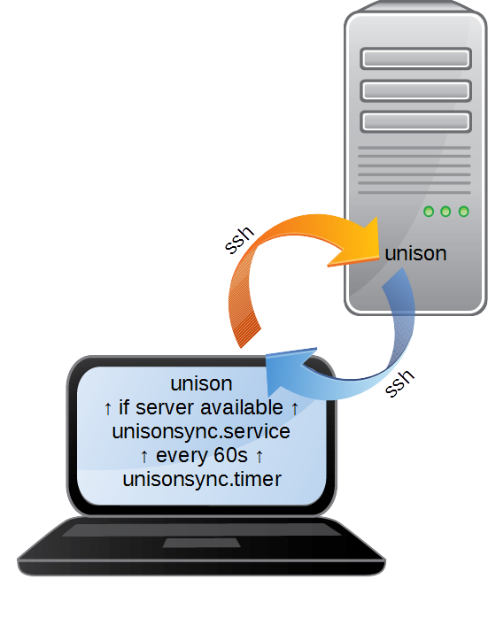

# roaming-homes

## Description
Roaming homes/profiles for linux with unison. On user login and after this every 60 seconds using a user space systemd.timer the user home get's synchronized with the server. It does not synchronize if the server is unavailable or another instance of unison is running. 

## Requirements
* ssh server where user can login without password this can be accomplished either with authorized ssh keys or in combination with an identity management server e.g. FreeIPA (https://www.freeipa.org)
* same version of unison installed on both clients and server
* client OS must support user space systemd units (systemctl --user). RHEL/CentOS do not yet support it. It is planned for version 8.
* python (>=2.7)

## Installation
At the moment the rpm has to be built first. You can then copy and paste it to other clients within same distro and install it directly.
1. `yum -y install rpmdevtools` 
1. `git clone https://github.com/radiorabe/roaming-homes.git`
1. `cd roaming-homes`
1. `rpmbuild -bb roaming-homes.spec`
1. `rpm -i ~/rpmbuild/RPMS/noarch/roaming-homes*.rpm`

## Configuration
Almost all configuration can be done in [/etc/roaming-homes/roaming-homes.conf](src/roaming-homes.conf). Unfortunately the synchronization frequency has to be set in seconds in [/usr/lib/systemd/user/unisonsync.timer](src/unisonsync.timer). After this you'll have to reload the systemd-daemon `systemd --user --global daemon-reload`.

## FAQ
* Why unison?

  Unison supports a client and server setup. It maintains a file system modification database on both ends which makes the synchronization more efficient than e.g. with rsync. Furthermore unison provides a huge amount of settings and logic out of the box.
* Why not nfs with cache?

  The solution with nfs requires a server that is always online. roaming-homes targets devices that are not always within the corporate network such as mobile workstations.
 
## TODOs
* Make rpms available for download
* Replace optparse with argparse because it's deprecated (https://docs.python.org/2/library/optparse.html#module-optparse)
* Notifications support for other desktop environments than gnome
* Find a proper way to set synchronization interval in configuration file

## Links
* https://www.cis.upenn.edu/~bcpierce/unison/
* https://www.freedesktop.org/software/systemd/man
** https://www.freedesktop.org/software/systemd/man/systemd.unit.html
** https://www.freedesktop.org/software/systemd/man/systemd.timer.html
** https://www.freedesktop.org/software/systemd/man/systemd.service.html
* https://docs.python.org/2/library/optparse.html 
* https://www.devdungeon.com/content/desktop-notifications-linux-python 
